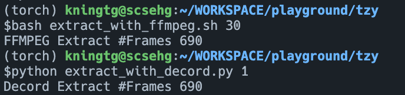
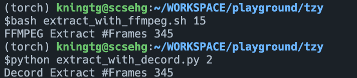
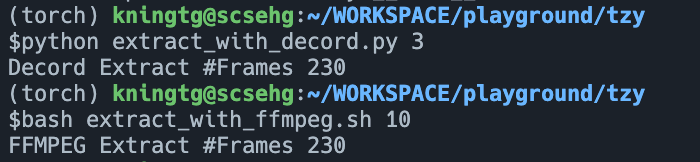
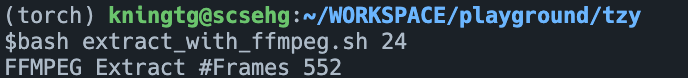

# Prepare

安装torchdata, decord, ffmpeg

# Result

```bash
ffprobe -v error -select_streams v:0 -show_entries stream=r_frame_rate -of default=noprint_wrappers=1:nokey=1 ZZXQF.mp4
```

可知ZZXQF.mp4的视频fps是30，视频总长23秒，共690秒

脚本参数

```
bash extract_with_ffmpeg.sh [fps]
python extract_with_decord.py [stride]
```

1. stride=1(取所有帧)



2. stride=2



3. stride=3

   
4. fps取非30的因数，如fps=24 (stride不为整数)



24/30 = 552/690
